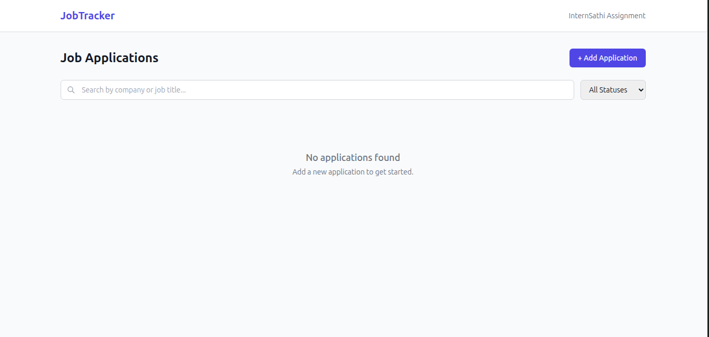
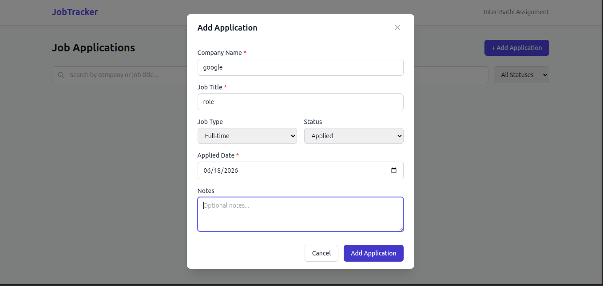
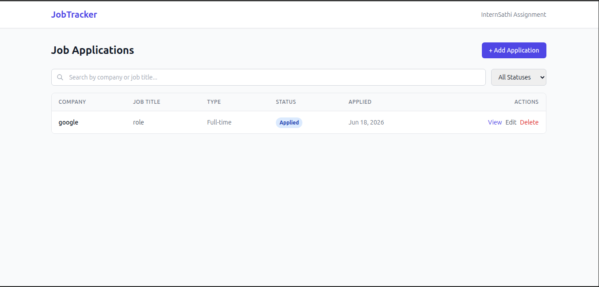

# Job Application Tracker

A full-stack web application for tracking job applications through different hiring stages. Built for the InternSathi Full Stack Internship assignment.

## Tech Stack

- **Frontend:** React 19, TypeScript, Vite, Tailwind CSS, TanStack React Query
- **Backend:** Express.js, TypeScript, Prisma ORM, Zod validation
- **Database:** SQLite (via Prisma)
- **API Style:** REST

## Prerequisites

- Node.js 18+ and pnpm (or npm/yarn)

## Installation

```bash
# Clone the repository
git clone <your-repo-url>
cd nexus

# Install backend dependencies
cd backend
pnpm install

# Install frontend dependencies
cd ../frontend
pnpm install
```

## Environment Variables

Backend (`backend/.env`):

```
DATABASE_URL="file:./dev.db"
PORT=4000
```

## Database Setup

```bash
cd backend
pnpm db:migrate
pnpm db:seed
```

## Running in Development Mode

Start the backend (from `backend/`):

```bash
pnpm dev
```

Start the frontend (from `frontend/`):

```bash
pnpm dev
```

The backend runs on `http://localhost:4000` and the frontend on `http://localhost:5173`.

## API Documentation

### REST Endpoints

| Method | Endpoint | Description | Query Params |
|--------|----------|-------------|-------------|
| GET | `/api/applications` | List all applications | `status`, `search`, `page`, `limit` |
| GET | `/api/applications/:id` | Get single application | |
| POST | `/api/applications` | Create application | |
| PATCH | `/api/applications/:id` | Update application (partial) | |
| DELETE | `/api/applications/:id` | Delete application | |
| GET | `/api/health` | Health check | |

### Application Schema

```json
{
  "id": 1,
  "companyName": "Google",
  "jobTitle": "Software Engineer",
  "jobType": "Internship | Full-time | Part-time",
  "status": "Applied | Interviewing | Offer | Rejected",
  "appliedDate": "2026-06-01T00:00:00.000Z",
  "notes": "Optional notes",
  "createdAt": "2026-06-18T00:00:00.000Z",
  "updatedAt": "2026-06-18T00:00:00.000Z"
}
```

## Features

- View all job applications in a table
- Filter by status (Applied, Interviewing, Offer, Rejected)
- Search by company name or job title
- Add new applications with form validation
- Edit existing applications
- Delete with confirmation dialog
- View application details
- Pagination support
- Responsive design

## Screenshots






